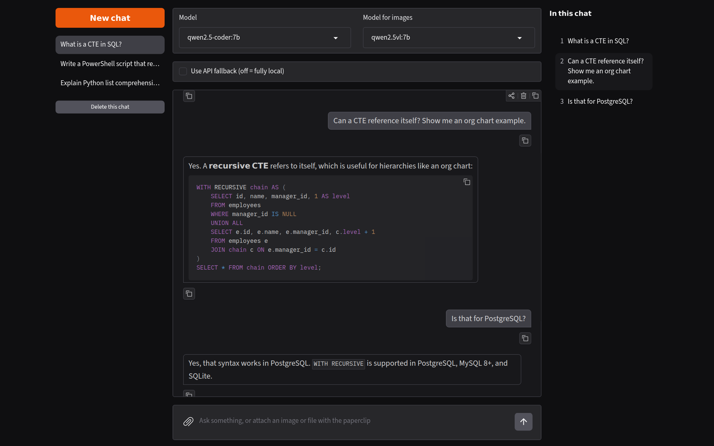

# Local AI Helper

A private chat assistant that runs entirely on your own computer. It uses [Ollama](https://ollama.com) to run open models locally and [Gradio](https://www.gradio.app) for a browser-based interface. Your questions, answers, and files never leave your machine.



## Features

- **Fully local.** Chats go only to Ollama on `localhost`, and the app works with no internet connection. Gradio's usage statistics are turned off.
- **Saved chats.** Every conversation is saved to disk. The left panel lists your chats; hover to see the full title, click to reopen.
- **Question navigator.** The right panel lists every question in the open chat. Click one to jump straight to it.
- **Attachments.** Attach text and code files (`.sql`, `.py`, `.csv`, `.md`, and more) and their contents are added to your question. Attach images and they are sent to a vision model.
- **Model switching.** Pick from your installed Ollama models in the app, with defaults set in a config file.
- **Redaction hook.** A `redact()` function runs on everything you send, ready for your own rules to mask sensitive text.

## Requirements

- Python 3.11 or newer
- [Ollama](https://ollama.com/download), installed and running
- At least one model pulled in Ollama

The defaults assume these models:

```
ollama pull qwen2.5-coder:7b
ollama pull qwen2.5vl:7b
```

`qwen2.5-coder` handles text and code. `qwen2.5vl` reads images and is optional. The 3B versions (`qwen2.5-coder:3b`, `qwen2.5vl:3b`) are noticeably faster on computers without a dedicated graphics card.

## Setup

```
git clone <this repository's URL>
cd local-ai-helper
python -m venv .venv
```

Activate the virtual environment:

- Windows (PowerShell): `.venv\Scripts\Activate.ps1`
- macOS or Linux: `source .venv/bin/activate`

Then install the dependencies:

```
pip install -r requirements.txt
```

## Configuration

Copy `config.example.toml` to `config.toml` and edit the copy. You can set:

| Setting | What it does |
|---|---|
| `text_model` | Default model for questions |
| `vision_model` | Default model for questions with images (`""` turns image support off) |
| `system_prompt` | Instructions the model sees at the start of every conversation |
| `max_history` | How many past messages are sent with each question |
| `max_text_chars` | Attached text files longer than this are cut off |
| `ollama_url` | Where Ollama is running |

Any setting you leave out uses the built-in default, and the app runs without a `config.toml` at all. If the file has a mistake, the app prints a message explaining it and uses the default for that setting. Changes take effect when you restart the script.

`config.toml` is listed in `.gitignore`, so your personal settings stay out of the repository.

## Usage

Make sure Ollama is running, then start the app:

```
python local_ai_helper.py
```

Open the address it prints, usually http://127.0.0.1:7860.

The model dropdowns change the model for the current browser tab. Refreshing the page goes back to the defaults from `config.toml`. After pulling a new model with `ollama pull`, refresh the page to see it in the list.

## Where your data is stored

Chats are saved as JSON files in a `chat_history` folder next to the script, and attachments are copied into `chat_history/attachments`. This folder is listed in `.gitignore`, so your conversations are never committed.

To back up your chats, copy the `chat_history` folder. To remove them all, delete it.

## Notes

- On a computer without a dedicated graphics card, the first answer after a few minutes of inactivity takes longer while Ollama loads the model into memory, and questions with images are slower than text-only ones.
- A model's knowledge is fixed when it's trained. For current information, attach documents to your question.
- The "Use API fallback" checkbox is a placeholder. `call_api()` does not contact any service until you add your own code.
